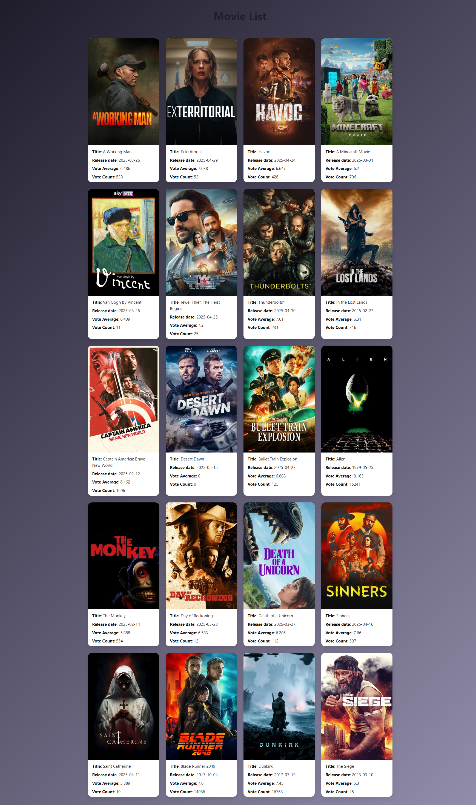

# 🎬 Movie Listing React App

A simple movie listing web application built with **React class components**, showcasing popular movies fetched from **The Movie Database (TMDB) API**.

---

## 🚀 Features

- 🔄 **Dynamic Movie Fetching** from TMDB
- 🎞️ **Card-based UI** with movie posters, titles, and ratings
- ⏳ **Loading Indicator** while data is being fetched
- 💅 **Responsive & Modern Design** using custom CSS
- 🔁 **Reusable Components**: `Cards`, `Card`, `Loading`

---

## 📸 Preview

  

---

## 🛠️ Technologies Used

- **React** (with Class Components)
- **CSS3** (Custom styling with Glassmorphism)
- **TMDB API** for movie data

---

## 📦 Installation

1. **Clone the repository**

```bash
git clone https://github.com/your-username/movie-listing-react-app.git
cd movie-listing-react-app
```

2. **Install dependencies**

```bash
npm install
```

3. **Start the development server**

```bash
npm start
```

🔑 API Key Setup
The app uses TMDB's public API. It’s currently hardcoded in Cards.js, but for best practices:

Create a .env file

- Add your TMDB API key:

```env
REACT_APP_TMDB_API_KEY=your_api_key_here
```
- Replace the fetch URL in Cards.js with:

```js
const res = await fetch(`https://api.themoviedb.org/3/discover/movie?sort_by=popularity.desc&api_key=${process.env.REACT_APP_TMDB_API_KEY}`);
```


